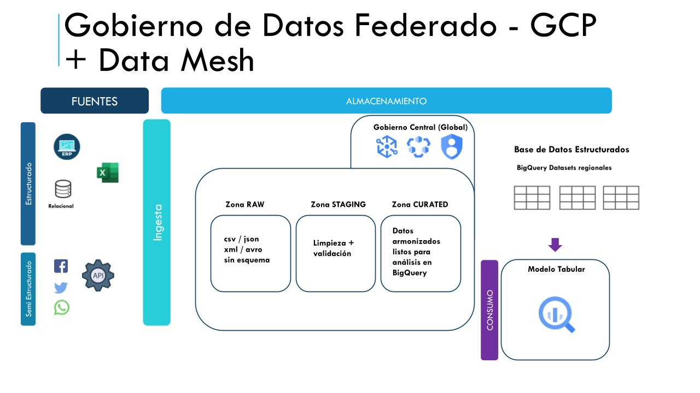
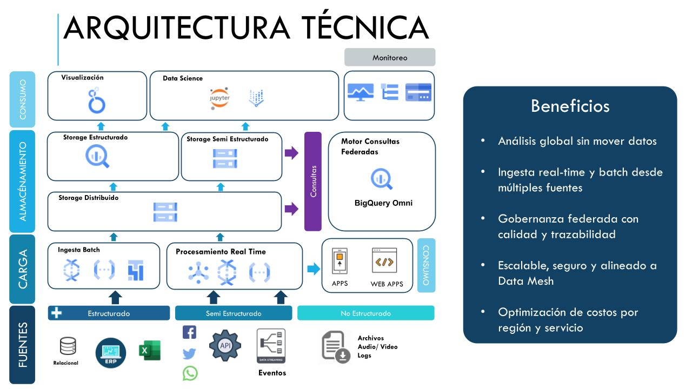

# ✈️ LATAM Airlines – Federated Data Platform on GCP

## Descripción General

Esta arquitectura propone un enfoque federado en Google Cloud Platform (GCP) para LATAM aerolínea global con presencia en múltiples regiones (Europa, América, Asia). Cada región opera de forma autónoma con su propia infraestructura de datos y pipelines, gestionando sus datos como "productos" que luego son compartidos para consumo global. El modelo se basa en principios de Data Mesh, otorgando responsabilidad local sobre la calidad, disponibilidad y documentación de los datos.

## Metodología y Principios Aplicados

Se adopta una arquitectura inspirada en Data Mesh, donde:

- Cada región es un dominio de datos autónomo, con propiedad sobre sus pipelines y almacenamiento.
- Los datos se tratan como productos, con responsabilidad sobre calidad, documentación y gobernanza.
- El gobierno de datos es federado, es decir, existe un gobierno central que define estándares y reglas, pero cada dominio los implementa localmente.
- Se aplican prácticas de DAMA-DMBOK para asegurar control sobre metadatos, calidad, acceso y trazabilidad.

**Esta metodología asegura escalabilidad organizacional, cumplimiento normativo y agilidad operativa.**

---

## Fuentes de Datos

Cada región consume datos generados por la aerolínea en diversas operaciones: ventas, check-in, reservas, telemetría de vuelos, entre otros.

### Componentes

- **Estructuradas**: bases relacionales (PostgreSQL en CloudSQL), ERP, Excel.  
- **Semi estructuradas**: APIs internas, archivos JSON/XML vía SFTP o MQTT.  
- **No estructuradas**: logs, audio, video, archivos grandes desde dispositivos o sistemas legacy.

---

## Carga (Ingesta Batch y Tiempo Real)

Ambos pipelines están orquestados mediante **Cloud Composer**, lo que permite ejecutar flujos programados con control de dependencias, monitoreo y tolerancia a fallos.

### Batch

Se implementan pipelines en **Dataflow Batch**, que leen desde **Cloud SQL**, archivos en **GCS** u otros sistemas legacy vía **SFTP**.  
Los datos se transforman y validan antes de pasar a la capa de almacenamiento.

**Ejemplo**:  
Un archivo con nuevos vuelos llega a GCS → dispara una **Cloud Function** → se lanza un pipeline en **Dataflow** que valida y carga a **BigQuery**.

### Streaming

Los eventos en tiempo real son enviados a **Pub/Sub**, consumidos por **Dataflow**.

**Ejemplo**:  
Los eventos se publican en **Pub/Sub**, procesados por **Dataflow Streaming**, escritos en **BigQuery** y **GCS** simultáneamente.

---

## Almacenamiento (Lakehouse por capas)

Este enfoque de zonas (**RAW**, **STAGING**, **CURATED**) garantiza control, auditoría y versionado.  
Además, la separación entre **GCS** y **BigQuery** permite una arquitectura **Lakehouse** eficiente y de bajo costo.

### Tipos de fuentes

- **Storage Distribuido**: Toda la ingesta aterriza inicialmente en **Cloud Storage**, lo que permite almacenar los datos en crudo (zona RAW) sin modificar su estructura.
- **Storage Semi Estructurado**: Datos como **JSON**, **Parquet** o **Avro** se almacenan en formatos eficientes para su posterior análisis o transformación.
- **Storage Estructurado**: Los datos procesados (limpios y armonizados) se cargan en **BigQuery**, estructurados en datasets regionales. Este es el punto de consumo principal para ciencia de datos y análisis BI.

---

## Consumo Analítico y Ciencia de Datos

- Las herramientas de negocio acceden a los datos ya armonizados mediante **Looker Studio**, conectándose a vistas autorizadas en **BigQuery**.
- Los científicos de datos usan **Jupyter** (y opcionalmente **Vertex AI Workbench** si se requiere escalar modelos), conectando a **BigQuery** o explorando datos desde **GCS**.
- Esta capa soporta tanto análisis **exploratorios** como reportes **programados**.  
  Gracias a la separación compute/storage de **BigQuery**, no hay contención entre usuarios o consultas.

---

## Consulta Federada (BigQuery Omni)

Para permitir consultas globales sin mover los datos entre regiones:

- **BigQuery Omni** actúa como motor de consulta distribuido, permitiendo lanzar SQL desde un proyecto central y ejecutar las partes correspondientes en cada región (local a los datos).
- Esto garantiza cumplimiento de **soberanía de datos** (los datos no se mueven) y mejora la eficiencia al mover solo resultados agregados.
- Se utilizan **vistas armonizadas** en cada dominio para asegurar la compatibilidad de los datos y facilitar el análisis federado.

**Ejemplo**:  
**BigQuery Omni** ejecuta SQL en distintas regiones sin mover los datos.  
Las vistas armonizadas facilitan la interoperabilidad.  
Un analista en EE.UU. lanza una consulta que combina la tabla de vuelos de Europa y reservas de Asia. **Omni** ejecuta localmente y entrega solo el resultado agregado.

---

## Gobierno de Datos Federado

Este nodo asegura que el **catálogo global** refleje los activos reales de cada región, facilite su descubrimiento y aplique reglas de seguridad y clasificación de forma automática y trazable.

### Componentes

- **Dataplex** actúa como tejido de datos unificado, detectando automáticamente activos nuevos en **GCS** y **BigQuery**, aplicando reglas de calidad y categorización.
- **Data Catalog** mantiene descripciones, etiquetas sensibles y versionado de esquemas.
- **IAM** se configura a nivel de columna, fila o dataset para controlar qué usuario puede acceder a qué parte del dato.

---

## Observabilidad y Costos

Se establecen **cuotas por proyecto, usuario o job** para evitar gastos inesperados.  
Todo el pipeline es medido, monitoreado y auditado mediante:

- **Cloud Monitoring** para visualizar métricas como latencia, volumen y errores.
- **Cloud Logging y Audit Logs** para revisar ejecución de jobs, acceso a datos y auditoría.
- **Cloud Billing Export a BigQuery** + dashboards en **Looker Studio** para seguimiento de costos por dominio.

---

